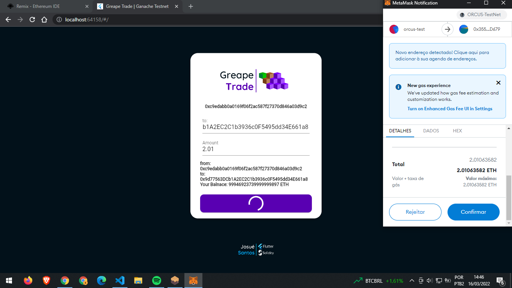

# Greape Trade

This project is a platform DeFi that you can send ETH to another person, more functions are comming soon.

## How to run

This project will use Ganache to simulate a blockchain to deploy the smart contract and run the Tests without pay any transation tax.
Flutter to create the front-end and Solidity to build the smart contract.

## Preview
Currently progress

## Sending ETH to another address
